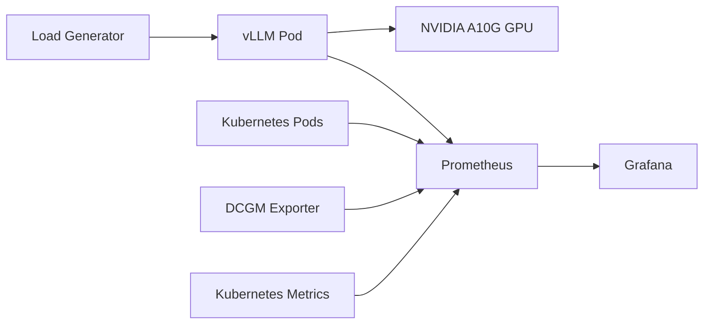

# GPU-Accelerated LLM Serving and Benchmarking with vLLM on AWS EKS

Benchmarking vLLM inference on Amazon EKS with GPU-backed serving, Kubernetes-native load generation, and Prometheus/Grafana observability.

This project deploys `Qwen/Qwen2.5-7B-Instruct` behind a vLLM OpenAI-compatible API on AWS EKS, runs controlled concurrency experiments, and captures GPU, latency, throughput, and queueing behavior through Grafana dashboards and load generator output.

## Why This Project?

This project studies how vLLM inference performance changes with concurrency and key runtime settings: `max-num-seqs`, `max-num-batched-tokens`, and `max-model-len`. The goal is to understand continuous batching, GPU utilization, KV cache pressure, and saturation behavior on a single NVIDIA A10G GPU.

## Architecture

- **EKS cluster** runs the inference and benchmark workloads.
- **GPU node group** hosts the vLLM serving pod on an NVIDIA A10G GPU.
- **CPU node group** runs the async Python load generator.
- **vLLM service** exposes the OpenAI-compatible `/v1/chat/completions` endpoint inside the cluster.
- **Prometheus** scrapes vLLM, Kubernetes, and GPU metrics.
- **Grafana** visualizes throughput, latency, GPU utilization, GPU memory, running requests, and waiting requests.

## Infrastructure Used

The cluster used separate CPU and GPU node groups so load generation and model serving could be scheduled independently.

- AWS EKS
- 2 x `t3.medium` CPU nodes
- 1 x `g5.2xlarge` GPU node
- NVIDIA A10G GPU
- Prometheus + Grafana + DCGM Exporter
- vLLM serving `Qwen/Qwen2.5-7B-Instruct`

## Tech Stack

- AWS EKS
- Kubernetes
- Terraform
- vLLM
- Qwen/Qwen2.5-7B-Instruct
- NVIDIA A10G on `g5.2xlarge`
- Prometheus
- Grafana
- DCGM Exporter
- Python async load generator with `aiohttp`

## Deployment Flow

1. Provision the EKS infrastructure and GPU node group.
2. Create the Hugging Face token secret in the `llm-demo` namespace.
3. Deploy the vLLM workload and service.
4. Deploy Prometheus, Grafana, and DCGM Exporter.
5. Apply the vLLM `ServiceMonitor` and benchmark dashboard ConfigMap.
6. Run load generator experiments from the CPU node group.
7. Capture benchmark results from terminal output and Grafana.

## Monitoring Stack

The monitoring stack uses Prometheus and Grafana with DCGM Exporter for GPU metrics. The benchmark dashboard tracks:

- GPU utilization
- GPU memory used
- Request throughput
- P95 latency
- Running requests
- Waiting requests
- vLLM pod CPU usage
- vLLM pod memory usage

## Benchmark Summary

All experiments used a prompt length target of `1024` and `max_tokens=512`.

| Experiment | Concurrency | max-num-seqs | max-num-batched-tokens | max-model-len | Mean Latency | P95 Latency | Req/s | GPU Util Max | GPU Mem Max | Summary |
|---|---:|---:|---:|---:|---:|---:|---:|---:|---:|---|
| A | 1 | 32 | 2048 | 2048 | 17.67s | 17.67s | 0.06 | Not reliably captured | 20043 MiB | Single request underuses the GPU. |
| B | 10 | 32 | 2048 | 2048 | 17.86s | 17.88s | 0.56 | Not reliably captured | 20027 MiB | Continuous batching improves throughput. |
| C | 20 | 32 | 2048 | 2048 | 17.97s | 17.99s | 1.11 | 100% | 20027 MiB | More concurrency keeps the GPU busy. |
| D | 20 | 64 | 2048 | 2048 | 15.66s | 18.39s | 1.09 | 100% | 20027 MiB | More sequence capacity adds headroom. |
| E | 20 | 64 | 4096 | 2048 | 17.98s | 17.99s | 1.11 | Not reliably captured | 20029 MiB | Larger token batches did not improve this saturated workload. |
| F | 50 | 64 | 4096 | 8192 | 21.56s | 21.96s | 2.32 | 100% | 20059 MiB | Sustained load shows saturation and latency growth. |

## Key Findings

- Increasing concurrency improved throughput through vLLM continuous batching.
- GPU utilization became clearly visible once concurrency reached Experiment C.
- Increasing `max-num-seqs` created scheduling headroom, but did not significantly improve throughput at concurrency 20.
- Increasing `max-num-batched-tokens` did not materially improve throughput for this workload because the GPU was already busy.
- Experiment F showed higher throughput with higher latency under sustained concurrency 50.
- GPU memory, running requests, waiting requests, and tail latency are the most useful signals for understanding vLLM serving behavior.

## Lessons Learned

- Continuous batching is the main source of throughput gains.
- GPU memory remains high even at low concurrency because model weights stay resident.
- Increasing `max-num-seqs` only helps when concurrency can use the extra scheduling headroom.
- Increasing `max-num-batched-tokens` does not automatically improve throughput.
- Long context length increases KV cache pressure.
- Throughput and latency must be analyzed together.

## Cost Note

The benchmark run cost approximately `$16.26`. The cluster was destroyed after experiments to avoid unnecessary AWS charges.

## Full Benchmark Report

Detailed configuration, screenshots, terminal evidence, and interpretation for each experiment are available in [benchmarks/benchmark-report.md](benchmarks/benchmark-report.md).
Detailed AWS and Kubernetes deployment verification screenshots are also included in the benchmark report.
