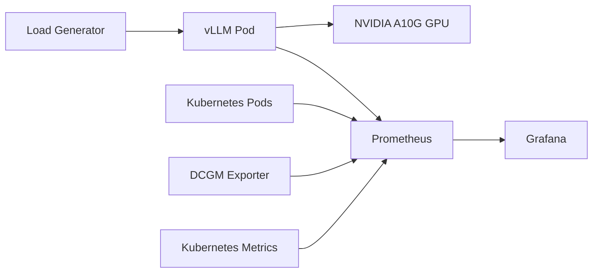

# GPU-Accelerated LLM Serving and Benchmarking with vLLM on AWS EKS

Benchmarking vLLM inference on Amazon EKS with GPU-backed serving, Kubernetes-native load generation, and Prometheus/Grafana observability.

This project deploys `Qwen/Qwen2.5-7B-Instruct` behind a vLLM OpenAI-compatible API on AWS EKS, runs controlled concurrency experiments, and captures GPU, latency, throughput, and queueing behavior through Grafana dashboards and load generator output.

## 1. Highlights

1. Deployed <u>**Qwen2.5-7B-Instruct**</u> on <u>**AWS EKS**</u> using <u>**vLLM**</u> for <u>**GPU-accelerated inference**</u>.
2. Built <u>**end-to-end observability**</u> using <u>**Prometheus**</u>, <u>**Grafana**</u>, and <u>**NVIDIA DCGM Exporter**</u>.
3. Implemented <u>**Kubernetes-native load generation**</u> and <u>**benchmarking workflows**</u>.
4. Executed <u>**six controlled benchmarking experiments (A-F)**</u> to evaluate <u>**inference performance**</u>.
5. Analyzed the effects of <u>**concurrency**</u>, <u>**`max-num-seqs`**</u>, <u>**`max-num-batched-tokens`**</u>, and <u>**`max-model-len`**</u> on <u>**throughput**</u> and <u>**latency**</u>.
6. Measured <u>**GPU utilization**</u>, <u>**GPU memory consumption**</u>, <u>**request throughput**</u>, <u>**latency**</u>, and <u>**queueing behavior**</u>.
7. Achieved <u>**sustained high GPU utilization**</u> under benchmark workloads.
8. Automated <u>**infrastructure provisioning**</u> with <u>**Terraform**</u> and deployed workloads on <u>**Amazon EKS**</u>.

## 2. Project Outcomes

1. Served Qwen2.5-7B-Instruct using vLLM on AWS EKS.
2. Benchmarked six controlled inference experiments (A-F).
3. Achieved 100% GPU utilization under sustained load.
4. Processed 150 successful requests at concurrency 50.
5. Built a full observability stack using Prometheus, Grafana, and NVIDIA DCGM Exporter.
6. Automated infrastructure provisioning and cluster lifecycle management using Terraform.

## 3. Quick Links

1. **Benchmark Report:** [`benchmarks/benchmark-report.md`](benchmarks/benchmark-report.md)
2. **Grafana Dashboard JSON:** [`grafana/vllm-benchmark-dashboard.json`](grafana/vllm-benchmark-dashboard.json)
3. **Kubernetes Manifests:** [`k8s/`](k8s/)
4. **Terraform Infrastructure:** [`llm-infra-eks-terraform/`](llm-infra-eks-terraform/)

## 4. Why This Project?

This project studies how vLLM inference performance changes with concurrency and key runtime settings: `max-num-seqs`, `max-num-batched-tokens`, and `max-model-len`. The goal is to understand continuous batching, GPU utilization, KV cache pressure, and saturation behavior on a single NVIDIA A10G GPU.

## 5. Architecture

1. **EKS cluster** runs the inference and benchmark workloads.
2. **GPU node group** hosts the vLLM serving pod on an NVIDIA A10G GPU.
3. **CPU node group** runs the async Python load generator.
4. **vLLM service** exposes the OpenAI-compatible `/v1/chat/completions` endpoint inside the cluster.
5. **Prometheus** scrapes vLLM, Kubernetes, and GPU metrics.
6. **Grafana** visualizes throughput, latency, GPU utilization, GPU memory, running requests, and waiting requests.

## 6. Infrastructure Used

The cluster used separate CPU and GPU node groups so load generation and model serving could be scheduled independently.

1. AWS EKS
2. 2 x `t3.medium` CPU nodes
3. 1 x `g5.2xlarge` GPU node
4. NVIDIA A10G GPU
5. Prometheus + Grafana + DCGM Exporter
6. vLLM serving `Qwen/Qwen2.5-7B-Instruct`

## 7. Tech Stack

1. AWS EKS
2. Kubernetes
3. Terraform
4. vLLM
5. Qwen/Qwen2.5-7B-Instruct
6. NVIDIA A10G on `g5.2xlarge`
7. Prometheus
8. Grafana
9. DCGM Exporter
10. Python async load generator with `aiohttp`

## 8. Deployment Flow

1. Provision the EKS infrastructure and GPU node group.
2. Create the Hugging Face token secret in the `llm-demo` namespace.
3. Deploy the vLLM workload and service.
4. Deploy Prometheus, Grafana, and DCGM Exporter.
5. Apply the vLLM `ServiceMonitor` and benchmark dashboard ConfigMap.
6. Run load generator experiments from the CPU node group.
7. Capture benchmark results from terminal output and Grafana.

## 9. Monitoring Stack

The monitoring stack uses Prometheus and Grafana with DCGM Exporter for GPU metrics. The benchmark dashboard tracks:

1. GPU utilization
2. GPU memory used
3. Request throughput
4. P95 latency
5. Running requests
6. Waiting requests
7. vLLM pod CPU usage
8. vLLM pod memory usage

## 10. Benchmark Summary

All experiments used a prompt length target of `1024` and `max_tokens=512`.

| Experiment | Concurrency | max-num-seqs | max-num-batched-tokens | max-model-len | Mean Latency | P95 Latency | Req/s | GPU Util Max | GPU Mem Max | Summary |
|---|---:|---:|---:|---:|---:|---:|---:|---:|---:|---|
| A | 1 | 32 | 2048 | 2048 | 17.67s | 17.67s | 0.06 | Not reliably captured | 20043 MiB | Single request underuses the GPU. |
| B | 10 | 32 | 2048 | 2048 | 17.86s | 17.88s | 0.56 | Not reliably captured | 20027 MiB | Continuous batching improves throughput. |
| C | 20 | 32 | 2048 | 2048 | 17.97s | 17.99s | 1.11 | 100% | 20027 MiB | More concurrency keeps the GPU busy. |
| D | 20 | 64 | 2048 | 2048 | 15.66s | 18.39s | 1.09 | 100% | 20027 MiB | More sequence capacity adds headroom. |
| E | 20 | 64 | 4096 | 2048 | 17.98s | 17.99s | 1.11 | Not reliably captured | 20029 MiB | Larger token batches did not improve this saturated workload. |
| F | 50 | 64 | 4096 | 8192 | 21.56s | 21.96s | 2.32 | 100% | 20059 MiB | Sustained load shows saturation and latency growth. |

## 11. Key Findings

1. Increasing concurrency improved throughput through vLLM continuous batching.
2. GPU utilization became clearly visible once concurrency reached Experiment C.
3. Increasing `max-num-seqs` created scheduling headroom, but did not significantly improve throughput at concurrency 20.
4. Increasing `max-num-batched-tokens` did not materially improve throughput for this workload because the GPU was already busy.
5. Experiment F showed higher throughput with higher latency under sustained concurrency 50.
6. GPU memory, running requests, waiting requests, and tail latency are the most useful signals for understanding vLLM serving behavior.

## 12. Lessons Learned

1. Continuous batching is the main source of throughput gains.
2. GPU memory remains high even at low concurrency because model weights stay resident.
3. Increasing `max-num-seqs` only helps when concurrency can use the extra scheduling headroom.
4. Increasing `max-num-batched-tokens` does not automatically improve throughput.
5. Long context length increases KV cache pressure.
6. Throughput and latency must be analyzed together.

## 13. Cost Note

The benchmark run cost approximately `$16.26`. The cluster was destroyed after experiments to avoid unnecessary AWS charges.

## 14. Full Benchmark Report

Detailed configuration, screenshots, terminal evidence, and interpretation for each experiment are available in [benchmarks/benchmark-report.md](benchmarks/benchmark-report.md).
Detailed AWS and Kubernetes deployment verification screenshots are also included in the benchmark report.
