# Benchmark Report

## Test Environment

| Item | Value |
|---|---|
| Cluster | AWS EKS |
| GPU | NVIDIA A10G |
| Instance | g5.2xlarge |
| Model | Qwen/Qwen2.5-7B-Instruct |
| Inference engine | vLLM |
| Monitoring | Prometheus + Grafana + DCGM Exporter |
| Kubernetes namespace | llm-demo |
| Prompt length | 1024 |
| Output length | 512 |

## Benchmark Matrix

| Experiment | Concurrency | max-num-seqs | max-num-batched-tokens | max-model-len | Prompt length | Output length | Mean latency | P95 latency | Req/s | GPU utilization | GPU memory | Interpretation |
|---|---:|---:|---:|---:|---:|---:|---:|---:|---:|---:|---:|---|
| A | 1 | 32 | 2048 | 2048 | 1024 | 512 | 17.67s | 17.67s | 0.06 | 0% | 20043 MiB | Single request baseline underuses the GPU. |
| B | 10 | 32 | 2048 | 2048 | 1024 | 512 | 17.86s | 17.88s | 0.56 | 0% | 20027 MiB | Continuous batching improves throughput with similar latency. |
| C | 20 | 32 | 2048 | 2048 | 1024 | 512 | 17.97s | 17.99s | 1.11 | 100% | 20027 MiB | Higher concurrency keeps the GPU busy and doubles throughput over B. |
| D | 20 | 64 | 2048 | 2048 | 1024 | 512 | 15.66s | 18.39s | 1.09 | 100% | 20027 MiB | Extra active sequence headroom did not significantly improve throughput at concurrency 20. |
| E | 20 | 64 | 4096 | 2048 | 1024 | 512 | 17.98s | 17.99s | 1.11 | 0% | 20029 MiB | Larger token batches did not materially improve an already saturated workload. |
| F | 50 | 64 | 4096 | 8192 | 1024 | 512 | 21.56s | 21.96s | 2.32 | 100% | 20059 MiB | Sustained concurrency 50 increased throughput and exposed latency growth. |

## Experiment A

### 1. Configuration

| Setting | Value |
|---|---:|
| Concurrency | 1 |
| max-num-seqs | 32 |
| max-num-batched-tokens | 2048 |
| max-model-len | 2048 |
| Prompt length | 1024 |
| Output length | 512 |
| Duration | One batch |

### 2. Results

| Metric | Value |
|---|---:|
| Success | 1/1 |
| Wall time | 17.67s |
| Mean latency | 17.67s |
| P50 latency | 17.67s |
| P95 latency | 17.67s |
| Req/s | 0.06 |
| GPU utilization max | 0% |
| GPU memory used max | 20043 MiB |
| Running requests max | 1 |
| Waiting requests max | 0 |

### 3. Grafana Evidence

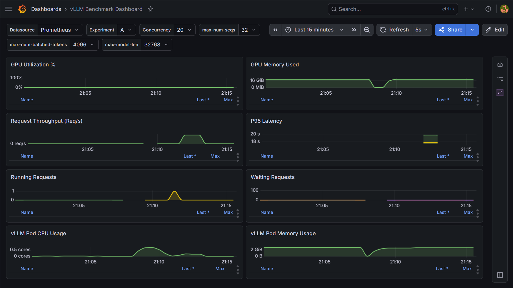

### 4. Loadgen Evidence

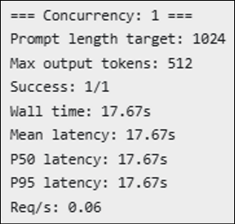

### 5. Interpretation

Experiment A establishes the single-request baseline. The request completed successfully, but throughput was low because only one request was active. GPU memory was already allocated for the loaded model, while GPU utilization remained low, confirming that a single request underuses the GPU.

## Experiment B

### 1. Configuration

| Setting | Value |
|---|---:|
| Concurrency | 10 |
| max-num-seqs | 32 |
| max-num-batched-tokens | 2048 |
| max-model-len | 2048 |
| Prompt length | 1024 |
| Output length | 512 |
| Duration | One batch |

### 2. Results

| Metric | Value |
|---|---:|
| Success | 10/10 |
| Wall time | 17.88s |
| Mean latency | 17.86s |
| P50 latency | 17.87s |
| P95 latency | 17.88s |
| Req/s | 0.56 |
| GPU utilization max | 0% |
| GPU memory used max | 20027 MiB |
| Running requests max | TODO |
| Waiting requests max | TODO |

### 3. Grafana Evidence

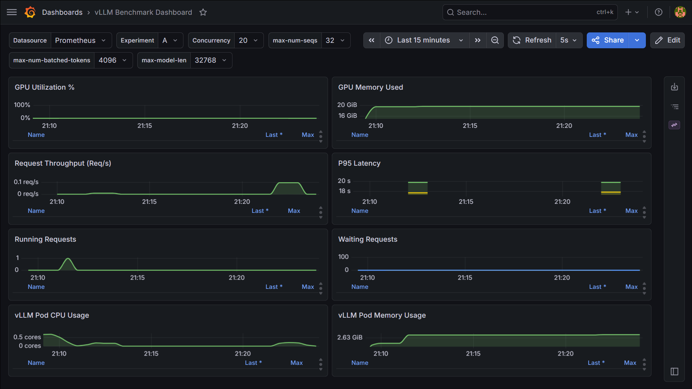

### 4. Loadgen Evidence

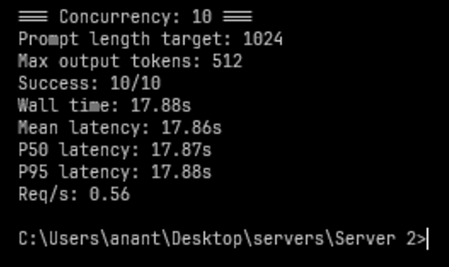

### 5. Interpretation

Experiment B increased concurrency from 1 to 10 while keeping vLLM settings unchanged. Throughput increased from 0.06 req/s to 0.56 req/s while latency stayed near the single-request baseline. This shows vLLM continuous batching handling concurrent work efficiently.

## Experiment C

### 1. Configuration

| Setting | Value |
|---|---:|
| Concurrency | 20 |
| max-num-seqs | 32 |
| max-num-batched-tokens | 2048 |
| max-model-len | 2048 |
| Prompt length | 1024 |
| Output length | 512 |
| Duration | One batch |

### 2. Results

| Metric | Value |
|---|---:|
| Success | 20/20 |
| Wall time | 17.99s |
| Mean latency | 17.97s |
| P50 latency | 17.97s |
| P95 latency | 17.99s |
| Req/s | 1.11 |
| GPU utilization max | 100% |
| GPU memory used max | 20027 MiB |
| Running requests max | 20 |
| Waiting requests max | 0 |

### 3. Grafana Evidence

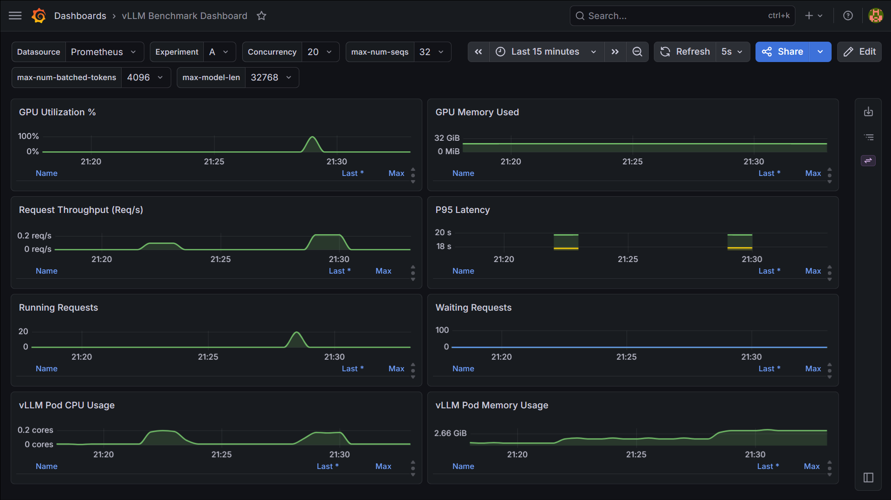

### 4. Loadgen Evidence

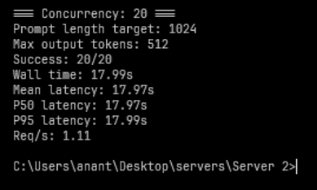

### 5. Interpretation

Experiment C increased concurrency from 10 to 20. Throughput nearly doubled from Experiment B while latency stayed almost flat. GPU utilization reached 100%, showing that the GPU was being kept busy by the higher concurrency level.

## Experiment D

### 1. Configuration

| Setting | Value |
|---|---:|
| Concurrency | 20 |
| max-num-seqs | 64 |
| max-num-batched-tokens | 2048 |
| max-model-len | 2048 |
| Prompt length | 1024 |
| Output length | 512 |
| Duration | One batch |

### 2. Results

| Metric | Value |
|---|---:|
| Success | 20/20 |
| Wall time | 18.40s |
| Mean latency | 15.66s |
| P50 latency | 15.36s |
| P95 latency | 18.39s |
| Req/s | 1.09 |
| GPU utilization max | 100% |
| GPU memory used max | 20027 MiB |
| Running requests max | 20 |
| Waiting requests max | 0 |

### 3. Grafana Evidence

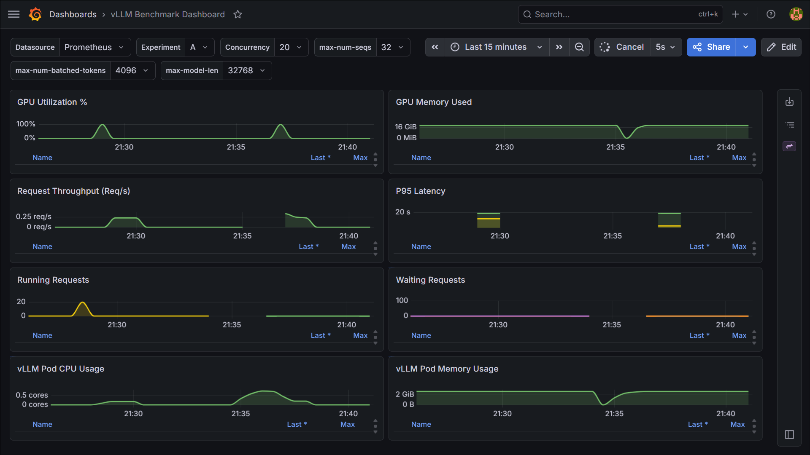

### 4. Loadgen Evidence

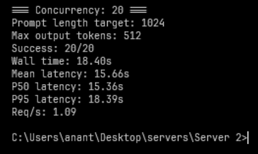

### 5. Interpretation

Experiment D increased `max-num-seqs` from 32 to 64 while keeping concurrency at 20. Throughput stayed essentially flat, which indicates that Experiment C was already able to schedule the offered load. The larger sequence capacity provides headroom for higher concurrency, but it did not materially improve this specific concurrency-20 workload.

## Experiment E

### 1. Configuration

| Setting | Value |
|---|---:|
| Concurrency | 20 |
| max-num-seqs | 64 |
| max-num-batched-tokens | 4096 |
| max-model-len | 2048 |
| Prompt length | 1024 |
| Output length | 512 |
| Duration | One batch |

### 2. Results

| Metric | Value |
|---|---:|
| Success | 20/20 |
| Wall time | 17.99s |
| Mean latency | 17.98s |
| P50 latency | 17.99s |
| P95 latency | 17.99s |
| Req/s | 1.11 |
| GPU utilization max | 0% |
| GPU memory used max | 20029 MiB |
| Running requests max | TODO |
| Waiting requests max | TODO |

### 3. Grafana Evidence

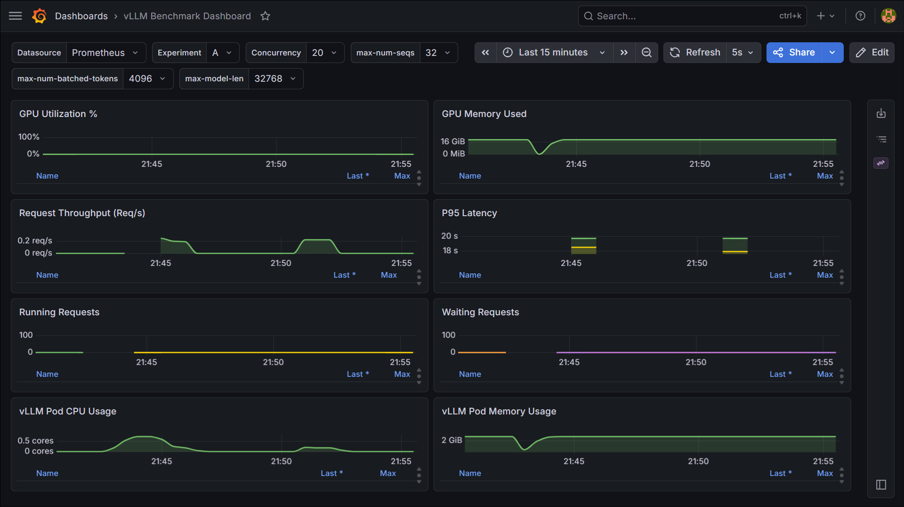

### 4. Loadgen Evidence

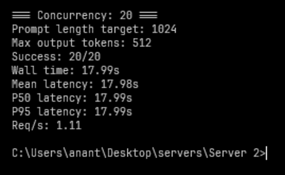

### 5. Interpretation

Experiment E increased `max-num-batched-tokens` from 2048 to 4096. Throughput remained close to Experiments C and D, which suggests the workload was already near saturation and was not bottlenecked by the previous token batch limit. The GPU utilization metric was not reliably captured in the final E snapshot, so the loadgen result and vLLM token counters are the stronger evidence for this run.

## Experiment F

### 1. Configuration

| Setting | Value |
|---|---:|
| Concurrency | 50 |
| max-num-seqs | 64 |
| max-num-batched-tokens | 4096 |
| max-model-len | 8192 |
| Prompt length | 1024 |
| Output length | 512 |
| Duration | 60 seconds |

### 2. Results

| Metric | Value |
|---|---:|
| Success | 150/150 |
| Wall time | 64.73s |
| Mean latency | 21.56s |
| P50 latency | 21.46s |
| P95 latency | 21.96s |
| Req/s | 2.32 |
| GPU utilization max | 100% |
| GPU memory used max | 20059 MiB |
| Running requests max | 50 |
| Waiting requests max | 0 |
| KV cache usage max | 23.62% |

### 3. Grafana Evidence

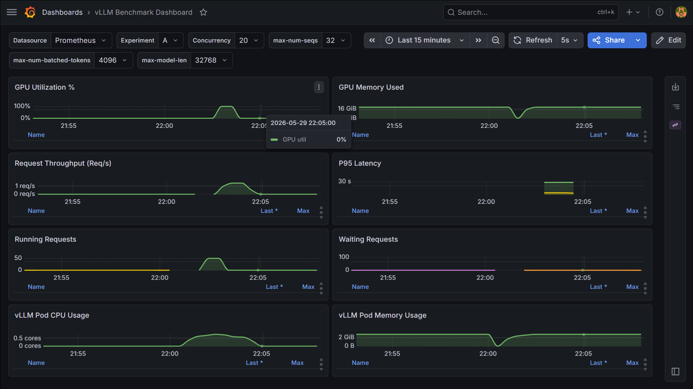

### 4. Loadgen Evidence

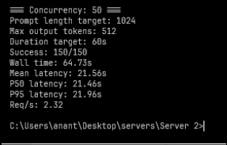

### 5. Interpretation

Experiment F increased concurrency to 50, raised `max-model-len` to 8192, and ran continuously for 60 seconds. Throughput increased to 2.32 req/s, while mean and tail latency also increased. Running requests reached 50 and waiting requests stayed at 0, showing that vLLM admitted the offered load without queue buildup. GPU utilization reached 100%, and KV cache usage increased, showing stronger memory pressure under sustained load.

## Key Findings

- Concurrency improves batching until the GPU approaches saturation.
- `max-num-seqs` affects how many active sequences vLLM can schedule at once. It provides headroom, but only helps when the offered concurrency can use it.
- `max-num-batched-tokens` affects the token batch size available to the engine. Increasing it helps when token batching is the bottleneck, but did not significantly improve the concurrency-20 workload.
- `max-model-len` increases KV cache capacity requirements and can raise memory pressure, especially under higher concurrency.
- Experiment F shows saturation and tail-latency growth: throughput increased, GPU utilization reached 100%, and latency rose under sustained concurrency 50.
- GPU memory, running requests, waiting requests, and tail latency are the most important signals for understanding vLLM serving behavior in production-like traffic.

